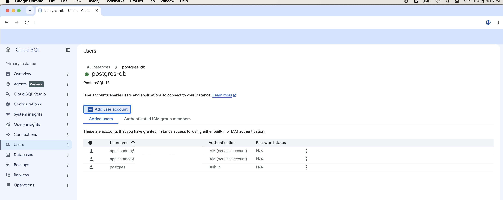

### IAM AUTH Postgres:

#### 1. Grant permissions to serviceaccount 
  > Doc: https://docs.cloud.google.com/sql/docs/postgres/add-manage-iam-users#add-policy-binding

Roles:
  1. roles/cloudsql.instanceUser
  2. roles/cloudsql.client


#### 2.  Create database role which will be assigned to serviceaccount user: 
  > Doc: https://docs.cloud.google.com/sql/docs/postgres/add-manage-iam-users#add-db-roles
    
```sql
    CREATE DATABASE appdb;
    CREATE ROLE approle;
    GRANT approle TO postgres;
    ALTER DATABASE appdb OWNER TO approle;
    GRANT CONNECT ON DATABASE appdb to approle;
    GRANT USAGE ON SCHEMA public TO approle;
    ALTER ROLE "<cloudrun-service-account>" SET role = approle;
```


#### 3. Add cloudrun serviceaccount to postgres db:
   

#### 4. Code:
  > Doc: https://docs.cloud.google.com/sql/docs/postgres/iam-logins#python
